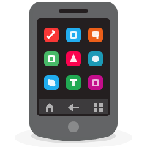

## <h1 align="center" > <samp> Olá! </samp></h1>

<h3>
<samp>
Meu nome é Yasmin Amorin, sou uma Desenvolvedora Web Frontend, apaixonada por arte, tecnologia e criar coisas!  
  
## 😎 Sobre Mim
  
- :telescope: Atualmente estou em busca de novas oportunidades.  
- :seedling: Estou aprendendo UX Design!  
- :gem: Constantemente aprofundando meu conhecimento de Frontend  
- :art: No meu tempo livre eu gosto de ler, desenhar, fazer crochê e jogar The Sims.
</samp>
</h3>

## <h1> <samp> Minhas Skills Primárias </samp></h1>

### Frontend

  
  
  
  
   
  
  
  
   

### Ferramentas   

    
  
   
    

 

### Design

  
  
  
   

 

## <h1><samp> Minhas Skills Secundárias </samp></h1>

### Desenvolvimento de jogos
  

  
  
  

  
### Backend

  
  
  
  
  
  

### Ferramentas
  
  
  
  
  

<h1><samp> Estatísticas do Meu Github </samp></h1>

<h1> <samp> Conecte-se comigo: </samp></h1>

 
   <samp><a href="https://www.linkedin.com/in/yasminamorins"> yasminamorins </a> </samp> 
   <samp><a href="mailto:amorin.yasmin378@gmail.com"> amorin.yasmin378 </a> </samp> 
   <samp><a href="https://https://yasminamorin.vercel.app/"> Meu Portifolio</samp> 

<h3 align="center" ><samp><q>Há coisas que só você pode criar!</q>  -- Fernanda Longoni -- </samp></h3>

<!---
Yasmin358/Yasmin358 is a ✨ special ✨ repository because its `README.md` (this file) appears on your GitHub profile.
You can click the Preview link to take a look at your changes.
--->
